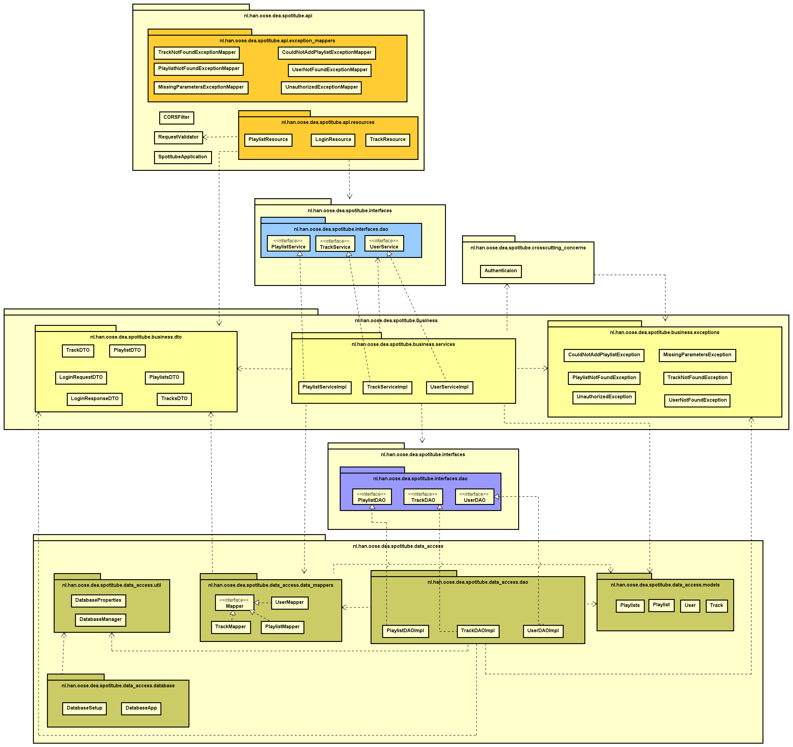
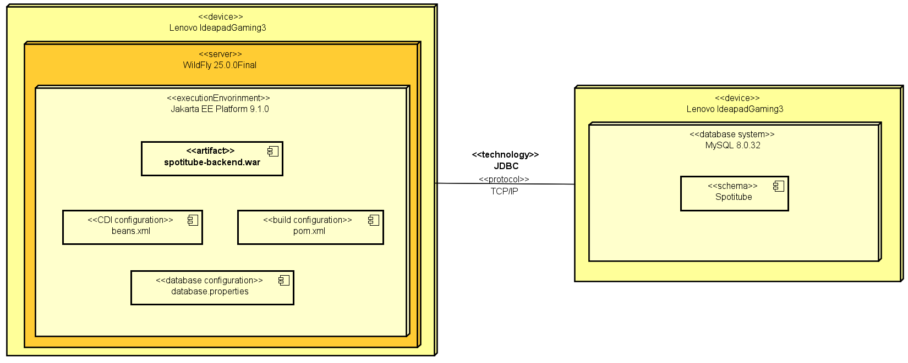
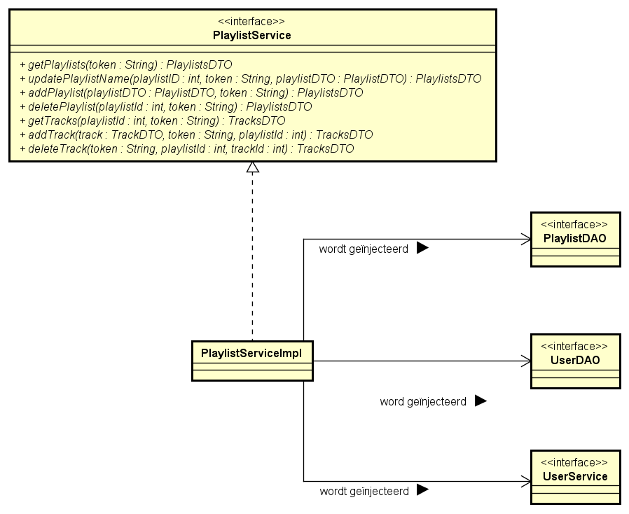
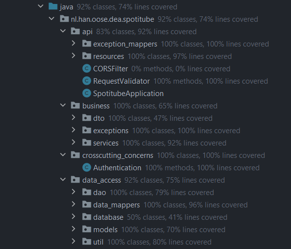

# Documentatie Spotitube
***
**Michelle Jolink**
 
**Studentnummer: 1669524**
 
**Versie: 1**
 
**Klas: ITA-OOSE-AF**
 
**Vak: DEA**
 
**Docent: Bart van der Wal**
 
**Datum: 25-05-2023**
***

## Inhoudsopgave
- [Documentatie Spotitube](#documentatie-spotitube)
  + [Inleiding](#inleiding)
  + [Lagenstructuur](#lagenstructuur)
  + [Deployment](#deployment)
    - [Database setup](#database-setup)
  + [Clean code principes](#clean-code-principes)
  + [Testing](#testing)
  + [Conclusie](#conclusie)
  + [Bronnen](#bronnen)

***

### Inleiding
In dit document beschrijf ik de implementatie van de Spotitube applicatie en de hierbij gemaakte ontwerpkeuzes. Om een helder beeld te geven van het systeem, is een package en deployment diagram opgesteld, waarin de structuur en de onderlinge relaties van de verschillende componenten worden weergegeven. Daarnaast wordt in dit document ingegaan waar ik de focus op heb gelegd bij het schrijven van de unittests.

### Lagenstructuur

| **Afbeelding 1. Package diagram Spotitube** |
***
Ik heb mijn code ingedeeld volgens het layer pattern. Dit is een ontwerppatroon dat waarbij de code opgedeeld wordt in verschillende lagen, elk met
een specifiek doel. Het idee achter het layer pattern is om de verschillende verantwoordelijkheden van een applicatie te
scheiden en te zorgen voor een losse koppeling tussen de
lagen [(Fowler, z.d.)](https://martinfowler.com/bliki/PresentationDomainDataLayering.html).

 
Ik heb de code van mijn applicatie onderverdeeld in drie lagen door deze te organiseren in verschillende packages:
 

`api`: Deze laag bevat de REST API met de verschillende resources waar de verzoeken van de front-end binnenkomen. Omdat
de front-end code en implementatie voor deze opdracht al was gegeven en je normaal gesproken een 'presentatie laag hebt' met de UX binnen het layer pattern, maar wij dit nu niet hebben,
heb ik ervoor gekozen om deze laag api te noemen aangezien dit nu alleen de REST api bevat. Deze sturen binnenkomende verzoeken
door naar de business-laag.
 
`business`: Deze laag bevat de logica die verantwoordelijk is voor het verwerken van de verzoeken die binnenkomen in de
api-laag. Verder interacteert deze laag met de data-access laag om gegevens te verkrijgen en terug te sturen naar de
api-laag.
 
`data-access-laag`: Dit is de laag die verantwoordelijk is voor de communicatie met de database. Deze laag ontvangt de
opdrachten vanuit de business-laag en voert deze uit op de database.

Ook heb ik nog een 2 andere packages die los staan van het layer pattern.

`crosscutting-concerns`: Hierin heb ik een klasse geplaatst die zorgt voor de
authenticatie van de gebruiker. Deze klasse bevat 2 functies die een wachtwoord kunnen hashen en kunnen decrypten. Dit zijn
aspecten van beveiliging die de gehele applicatie raken, en hierdoor niet in een van de 3 lagen
thuishoort. [(Beukema, 2021, 14 oktober)](https://peterbeukema.medium.com/top-10-cross-cutting-concerns-4cf30f7ab7fa), [(Anderson, 2015, 19 augustus)](https://softwareengineering.stackexchange.com/questions/262424/where-does-authorization-fit-in-a-layered-architecture).

`interfaces`: **NOTE: In het diagram staat deze folder er 2 keer, maar
in werkelijkheid is er maar 1! Dit heb ik gedaan omdat het diagram anders erg onoverzichtelijk werd door lijnen die
overal door elkaar heen liepen.** Hiermee implementeer ik het `seperated interface pattern`. Ik heb de interfaces voor de DAO's en
Services klassen hierin geplaatst en de implementaties ervan in hun eigen laag (services package). Hierdoor zijn de klassen die deze
interfaces gebruiken nu niet afhankelijk van de laag waar de implementatie zich
bevindt [(Fowler, z.d)](https://www.martinfowler.com/eaaCatalog/separatedInterface.html).

Ik heb het `data mapper pattern` geïmplementeerd door gebruik te maken van Data Access Objects (DAO's) binnen de
data-access laag. Volgens Martin Fowler moeten de in-memory objecten, in dit geval de DTO's, gescheiden zijn van
de database [(Fowler, z.d)](https://martinfowler.com/eaaCatalog/dataMapper.html).
In mijn implementatie is de data-access laag verantwoordelijk voor de interactie met de database, en binnen de DAO's
staan de implementaties voor alle database calls. Hierdoor haalt de businesslaag alleen de benodigde informatie op, maar
weet totaal niks van de database-implementatie.
 

Iets wat ik beter had kunnen doen is dat volgens Martin Fowler de dependencies meestal van boven naar beneden lopen: "presentation depends on the domain, which then depends on the data-source" [(Fowler, z.d)](https://martinfowler.com/bliki/PresentationDomainDataLayering.html). Dit klopt bij mij niet helemaal,
aangezien de data-access laag dependencies heeft naar 2 packages binnen de business-laag: de DTO's package en de exceptions package.

### Deployment

| **Afbeelding 2. Deployment diagram Spotitube** |
***
Dit is het deployment diagram van mijn gerealiseerde spotitube applicatie. Links zien we de execution omgeving waarin de
code gerund wordt door middel van Jakarta EE. De artifact `spotitube-backend.war` bevat alle code en benodigde
configuratie bestanden. Drie belangrijke configuratie bestanden zijn ook te zien als componenten van de Jakarta EE.
 
`beans.xml`: bevat de configuratie om het framework CDI werkend te krijgen. Zonder dit bestand werkt de dependency
injection niet.
 
`pom.xml`: bevat de project-configuratie van onder andere de specificaties van gebruikte dependencies en plugins.
 
`database.properties`: Dit is het bestand waarin wordt gespecificeerd welke driver, logingegevens en connectionstring er
wordt gebruikt voor de database connectie.

Rechts zien we de MySQL database met het enige schema spotitube.

Dit deployment diagram voldoet aan de requirement van de casusbeschrijving dat de Spotitube-applicatie deployed kan
worden op een Jakarta EE Applicatie-container, omdat het laat zien dat de applicatie wordt deployed op een Wildfly
server, die is geconfigureerd met een Jakarta EE-platform. De spotitube-backend.war component, die de applicatiecode en
configuratie van de applicatie bevat, wordt ook binnen deze Node geplaatst en draait dus binnen de Jakarta
EE-runtime-omgeving. Dit betekent dat de applicatie kan worden ontwikkeld en getest volgens de Jakarte EE-specificaties
en kan worden deployed op elk Jakarta EE-compatibel platform.

Daarnaast sluit het diagram ook aan op de eis dat de applicatie meerdere relationele databases moet kunnen ondersteunen
en er runtime via een configuratiebestand gewisseld moet kunnen worden.
In het deployment diagram wordt dit duidelijk door de associatie tussen de node van de Jakarta EE-platform en de node
van de MySQL-database. De communicatie tussen deze twee nodes vindt plaats via het JDBC-protocol, wat ervoor zorgt dat
de Spotitube-applicatie kan communiceren met de MySQL-database en zo de verschillende relationele databases kan
ondersteunen. De specificaties voor de databaseverbinding staan in het database.properties bestand. Dit bestand wordt
binnen het Jakarta EE-platform gebruikt om de juiste database te selecteren op basis van de runtime configuratie.

Uit het deployment diagram is af te leiden door het component CDI configuration binnen de Jakarta EE-container dat de
applicatie gebruikt maak van Contexts & Dependency Injection. Dit raakt de requirement dat de applicatie gebruik moet
maken van het framework CDI.

Doordat dit framework wordt toegepast, kun je ook afleiden dat de applicatie is opgedeeld in verschillende lagen en
gebouwd is op het principe van het Layered Architecture pattern. Dit zorgt voor meer modularisatie binnen de
applicatie en vergemakkelijkt het onderhoud, uitbreiding en het testen.

In de huidige implementatie is gekozen voor server WildFly, omdat volgens Wildfly
de applicatie server erg flexibel en simpel in gebruik is. Bovendien ondersteunt het de laatste REST-standaarden
waaronder JAX-RS [(WildFly, z.d.)](https://www.wildfly.org/about/).

Volgens Oracle is JDBC een Java API die verbinding kan maken en bewerkingen kan uitvoeren op veel verschillende soorten
databases [(Oracle, 2010)](https://docs.oracle.com/cd/E19226-01/820-7688/gawms/index.html). Dit is ook weer handig als
er gewisseld moet worden van database.

Een alternatieve oplossing voor het gebruik van de Wildfly-server als de runtime-omgeving voor de Jakarta
EE-platformomgeving zou kunnen zijn om een andere Java Enterprise-applicatieserver te gebruiken, zoals Glassfish.
GlassFish is volledig compatibel met Jakarta EE en ondersteund JAX-RS en CDI, wat ook wordt gebruikt binnen de
applicatie [(Oracle, 2020)](https://blogs.oracle.com/javamagazine/post/transition-from-java-ee-to-jakarta-ee).

Een alternatieve oplossing voor het gebruik van de JDBC-technologie voor de communicatie tussen de database en de
Jakarta EE-environment zou de JPA API kunnen zijn. Met JDBC worden sql-statements uitgevoerd op de database om gegevens
op te halen of te veranderen. JPA biedt een abstractie van de database door middel van objecten. Dit kan de ontwikkeling
van de applicatie vereenvoudigen en de hoeveelheid code verminderen die nodig is voor de communicatie met de
database. [(Thivent, 2010)](https://stackoverflow.com/questions/2397016/C)

#### Database setup

Voor het gebruik van de applicatie is het nodig om het create-script voor de database uit te voeren. Allereerst moet u
een lege database aanmaken en de naam hiervan aanpassen in het bestand `database.properties` waar op dit moment
_spotitube_ staat. Indien u dezelfde databasenaam gebruikt, hoeft u dit niet aan te passen. Het is wel nodig om de
waardes van `user` en `pass` aan te passen in hetzelfde bestand, zodat u verbinding kunt maken met uw eigen database.
Vervolgens kunt u het bestand `DatabaseApp.java` uitvoeren, waardoor de vereiste tabellen en dummy data voor de tracks
worden toegevoegd aan de database. Gebruikt u een ander databasemanagementsysteem dan MySQL, dan zult u ook de `driver`
aan moeten passen.

### Clean code principes

| **Afbeelding 3. Class diagram Clean code** |
***

**NOTE: Verdere implementatie van PlaylistServiceImpl is weggelaten.**

Met dit diagram toon ik aan dat ik Dependency Inversion Principle heb gebruikt en het Open/Closed principle.
Het OCP wordt gehandhaafd doordat de code niet afhankelijk is van concrete klassen, maar van interfaces. Als er nieuwe
functionaliteiten moeten worden toegevoegd, kan dit worden gedaan door nieuwe code toe te voegen, in plaats van de
bestaande code te wijzigen. Hierdoor kan de implementatie van een interface worden vervangen door een andere
implementatie zonder dat de code hoeft te worden gewijzigd, bijvoorbeeld door een nieuwe klasse toe te voegen genaamd
PlaylistServiceYoutube die ook de PlaylistService implementeert, maar een compleet andere implementatie heeft van de
functies. Dit maakt het ook gemakkelijker om unit tests te schrijven omdat er mock-implementaties van de interfaces
kunnen worden gebruikt om de code te testen zonder dat er toegang tot de database nodig is.

Daarnaast wordt DIP toegepast omdat de PlaylistDAO, UserDAO en UserService worden geïnjecteerd. Hierdoor is de
PlaylistServiceImpl niet afhankelijk van de concrete implementaties van deze klassen, maar alleen van de interfaces die
ze implementeren. Dit maakt het eenvoudiger om de code te onderhouden en te wijzigen in de toekomst, omdat er geen
directe afhankelijkheid is van de concrete klassen en hun implementaties. [(Abba, 26 april 2022)](https://www.freecodecamp.org/news/solid-principles-single-responsibility-principle-explained/)

### Testing

Voor mijn unittests heb ik gestreefd naar een code coverage van minstens 80%. Ik ben hier niet helemaal in geslaagd,
voor de package data_access kwam ik niet verder dan een totale line coverage van 75%, en de business package, waarbij ik
niet verder kwam dan 65%. Dit kwam vooral door een lage line coverage van de dto package. Maar deze package was niet nodig om te testen aangezien dit alleen getters en setters bevat.

| **Afbeelding 4. Code coverage unittests** |
***
Voor het schrijven van de unittests heb ik gebruik gemaakt van het framework JUnit. Daarnaast heb ik gebruik gemaakt van
Mockito, een mock-object framework waarmee ik geïsoleerde tests kon schrijven.

Mijn focus bij het testen lag vooral op de services, zowel de classes als de line coverage, omdat hierin alle logica van
de applicatie plaatsvindt. Het is daarom van groot belang dat alle klassen en verschillende scenario's hierin getest
worden. Het testen van de business/service logica is erg belangrijk omdat het de kern vormt van de functionaliteit van
de applicatie. Dit is de code die bepaalt hoe gegevens worden verwerkt, bewerkt en doorgestuurd tussen de lagen en welke
acties de applicatie onderneemt in reactie op verschillende gebeurtenissen of verzoeken.

Bij het testen van de code heb ik niet alleen gefocust op de services, maar ook op de resources en DAO's. Dit is
belangrijk omdat deze onderdelen een belangrijke rol spelen in de communicatie tussen de applicatie en de client.

Ik heb mijn best gedaan om zoveel mogelijk scenario's van de resources te testen om te verifiëren of de verwachte data
daadwerkelijk wordt geretourneerd naar de client.

Daarnaast heb ik mijn best gedaan om de DAO's te testen, waarbij ik gebruik heb gemaakt van een mocked connection.
Hiermee heb ik kunnen verifiëren of de queries correct worden uitgevoerd zonder daadwerkelijk verbinding te maken met de
database.

Al met al ben ik tevreden over de uitgevoerde tests en het behaalde resultaat. Het testen van de verschillende lagen in
de applicatie heeft mij een goed beeld gegeven van de werking van de code en heeft bijgedragen aan een betrouwbaardere,
veiligere en beter presterende applicatie.

### Conclusie
In dit document is een gedetailleerd overzicht gegeven van de implementatie van de Spotitube applicatie en de ontwerpkeuzes die zijn gemaakt. De code is opgedeeld volgens het layer pattern, waarbij de verantwoordelijkheden van de applicatie zijn gescheiden in de api-, business- en data-access-lagen. Het deployment diagram laat zien hoe de applicatie wordt gedeployed op een Jakarta EE-platform met behulp van een Wildfly-server. De huidige implementatie maakt gebruik van een MySQL-database, maar het ontwerp is zo flexibel dat de database eenvoudig kan worden vervangen door een andere relationele database door middel van de configuratie in het database.properties bestand, waardoor de applicatie beter kan worden aangepast aan toekomstige behoeften en vereisten. De implementatie volgt clean code principes, zoals het gebruik van interfaces en het toepassen van dependency inversion en het open/closed principe. Bij het schrijven van de unittests lag de focus met name op de services en het bereiken van een code coverage van minstens 80%. Ondanks dat niet alle coverage-doelen zijn behaald, zijn de belangrijkste logica en scenario's in de services uitgebreid getest.

### Bronnen

WildFly. (z.d.). _About the WildFly Project_. WildFly. Geraadpleegd op 19 april 2023, van https://www.wildfly.org/about/
 
Oracle. (2010). _Supported JDBC Drivers and Databases_. Oracle. Geraadpleegd op 19 april 2023,
van https://docs.oracle.com/cd/E19226-01/820-7688/gawms/index.html
 
Oracle. (2020). _Transition from Java EE to Jakarta EE_. Oracle. Geraadpleegd op 19 april 2023,
van https://blogs.oracle.com/javamagazine/post/transition-from-java-ee-to-jakarta-ee
 
Thivent, P. (2010, 7 maart). _Java - JDBC alternatives_. StackOverflow. Geraadpleegd op 19 april 2023,
van https://stackoverflow.com/questions/2397016/C
 
Beukema, P. (2021, 14 oktober). _10 Frequently Occurring Cross-Cutting Concerns_. peterbeukema. Geraadpleegd op 19 april
2023, van https://peterbeukema.medium.com/top-10-cross-cutting-concerns-4cf30f7ab7fa
 
Fowler, M. (z.d). _Data Mapper_. martinfowler. Geraadpleegd op 23 april 2023,
van https://martinfowler.com/eaaCatalog/dataMapper.html
 
Fowler, M. (z.d). _Separated Interface_. martinfowler. Geraadpleegd op 27 april 2023, van
https://www.martinfowler.com/eaaCatalog/separatedInterface.html
 
Fowler, M. (z.d). _PresentationDomainDataLayering_. martinfowler. Geraadpleegd op 27 april 2023, van https://martinfowler.com/bliki/PresentationDomainDataLayering.html
 
Abba, I. (2022, 26 april). _SOLID Definition – the SOLID Principles of Object-Oriented Design Explained_. freecodecamp.
Geraadpleegd op 23 april 2023,
van https://www.freecodecamp.org/news/solid-principles-single-responsibility-principle-explained/

